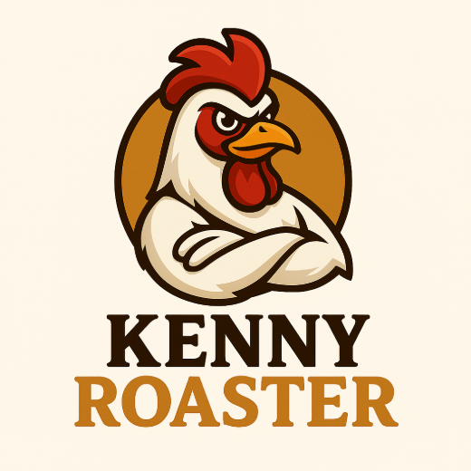
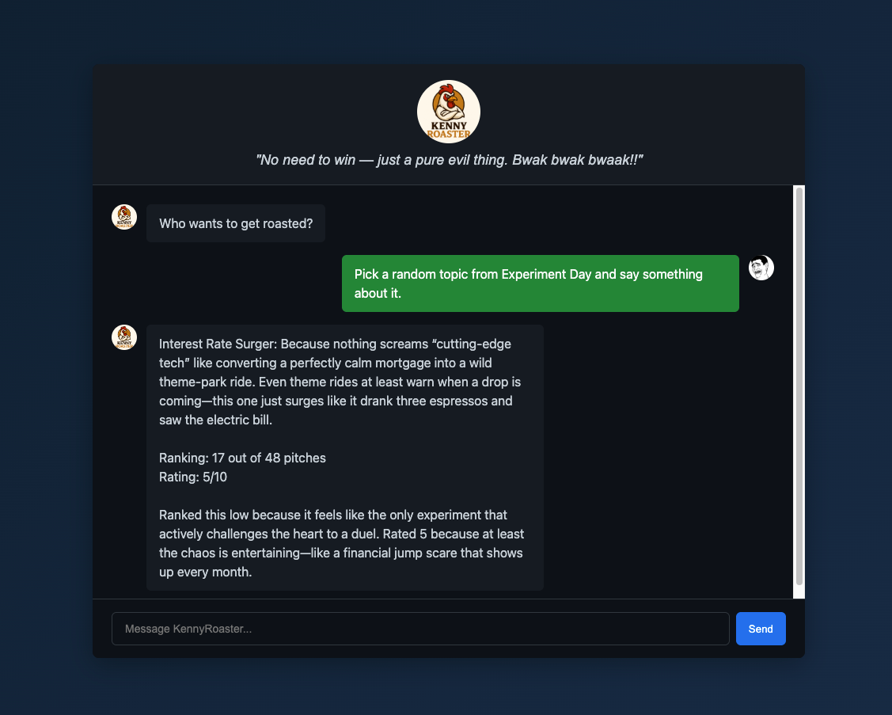

  

<h1 align="center">🔥 KennyRoaster.AI</h1>
<h4 align="center">Author: Patrick Mark Garcia Mazo</h4>

  <em>Your brutally honest AI hackathon judge that roasts your pitch before the judges do.</em>

KennyRoaster.AI is an AI-powered pitch evaluator designed for hackathons and innovation events. It analyzes your idea, scores it, and delivers hilariously savage (but actionable) feedback to help you improve fast.

---

## 🚀 Features

- 🧠 **AI Pitch Evaluation**
  - Analyzes ideas based on feasibility, impact, and originality
- 🔥 **Roast Mode**
  - Delivers funny, brutally honest feedback to highlight weaknesses
- 📊 **Scoring System**
  - Provides structured scoring to simulate real hackathon judging
- ⚡ **Fast Feedback Loop**
  - Get instant insights to iterate your idea quickly
- 🧑‍💻 **Dev-Friendly**
  - Built for developers, founders, and hackathon teams

---

## 🎯 Use Cases

- 🏆 Hackathon practice and preparation  
- 💡 Idea validation before pitching  
- 🎤 Pitch improvement and storytelling refinement  
- 😂 Team fun & engagement (with a little pain)

## 🎯 Deployment Instructions
- Check deploy.sh
- Do not execute it, I'm just used to creating notes in .sh format LMAO :)

## 📸 Demo

## 📈 Future Improvements

- Multi-agent judging (technical, business, UX perspectives)
- Leaderboard for best pitches
- Live demo scoring during events
- Integration with hackathon platforms

## 🤝 Contributing
Contributions are welcome!
Feel free to open an issue or submit a PR to improve the roast quality 😈

## ⚠️ Disclaimer
KennyRoaster.AI is designed for humor and rapid iteration.
Roasts may hurt feelings — but that’s the point. 😄

